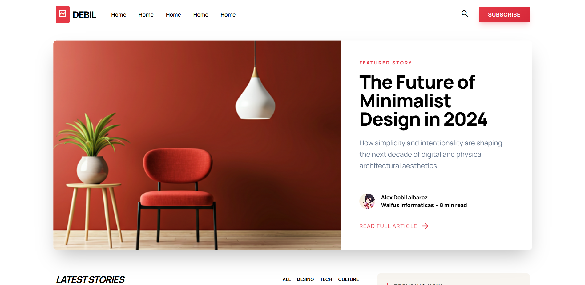

# SayUI

> A minimal, modular and elegant UI component library built with SCSS.


---

##  Overview

SayUI is a lightweight UI library designed with a **clean architecture** based on:

* Layouts (structure)
* Components (reusability)
* Foundations (Design Tokens)

Built for scalability, readability and modern frontend workflows.

---

##  Features

* SCSS modular architecture
* BEM naming convention (`ui-*`)
* Fully reusable components
* Layout-driven design system
* Single CSS output (easy integration)

---

##  Preview

<p align="center">
  
  
  
</p>

<p align="center">
  
  
  
</p>
<p align="center">
  
  
  
</p>
<p align="center">
  
  
</p>

---

## Architecture
```
index.html (demo shell)
   │
   ├── Main Layout (ui-page)
   │      └── Components (banner, sidebar, cards)
   │
   └── Editorial Layout (ui-editorial-page)
          └── Components (article, comments, related)

Shared:
→ Foundations (Design Tokens, Typography, Mixins)
```   
---

## Run Demo

SayUI provides two layout structures:

- **Main Layout** → General UI page
- **Editorial Layout** → Article-focused page

These are layout templates, not standalone pages.

To preview them, open: demo/index.html

Then insert the desired layout inside the `<body>`.

Only one layout should be used at a time.

### Example

```html
<body>

  <!-- Main layout -->
  <div class="ui-page">
    <!-- includes topbar, layout, sidebar, footer -->
  </div>

  <!-- Editorial layout -->
  <header class="ui-editorial-topbar"></header>
  <main class="ui-editorial-page"></main>
  <footer class="ui-footer-editorial"></footer>

</body>
```

---

##  Installation

Include the compiled CSS file:

```html
<link rel="stylesheet" href="dist/css/sayui.css">
```
---

## ⚠️ Global Styles

> [!IMPORTANT]  
> SayUI components rely on a minimal global stylesheet.  
> You must include these base styles before using any component. Otherwise, layout and spacing may break.  
> They behave similarly to a lightweight CSS reset.  
>  
> These styles ensure visual consistency across all components.

### Base Styles (required)

```css
* {
    box-sizing: border-box;
    border-width: 0;
    border-style: solid;
    --border-light: #e5e7eb;
    border-color: var(--border-light);
}

html {
    font-size: 16px;
    line-height: 1.5;
    -webkit-text-size-adjust: 100%;
    -moz-tab-size: 4;
    tab-size: 4;
    font-family: ui-sans-serif, system-ui, sans-serif, "Apple Color Emoji", "Segoe UI Emoji", "Segoe UI Symbol", "Noto Color Emoji";
    font-feature-settings: normal;
    font-variation-settings: normal;
    -webkit-tap-highlight-color: transparent;
}

h1,
h2,
h3,
h4,
h5 {
    margin: 0;
}

p {
    margin: 0;
}

body {
    display: block;
    margin: 0;
    font-family: Manrope, sans-serif;
    line-height: inherit;
}

a {
    text-decoration: none;
    color: inherit;
}

button {
    -webkit-appearance: button;
    appearance: button;
    background-color: transparent;
    font-family: inherit;
    font-variation-settings: inherit;
    margin: 0;
    padding: 0;
    cursor: pointer;
}
```
---

##  Project Structure
```
src/
  components/
    banner/
    ui-footer/
    ui-footer-editorial/
    ui-topbar/
    ui-sidebar/
    ui-main-header/
    ui-post-card/
    ui-post-grid/
    ui-editorial-topbar/

    article/
      ui-article-hero/
      ui-article-main/
      ui-article-related/
      ui-article-comments/

  layouts/
    ui-page/
    ui-layout/
    ui-main/
    ui-editorial-page/
    ui-editorial-grid/

  styles/
    base/
    foundations/
      _variables.scss
      _typography.scss
      _mixins.scss

    main.scss

dist/
  css/
    sayui.css

demo/
  img/
  index.html
  editorial.html
  main.html
  demo.css

docs/
  img/
  
```

---

##  Components

### Banner

```html
<section class="ui-banner"></section>
```

### Sidebar

```html
<aside class="ui-sidebar"></aside>
```

### Post Card

```html
<article class="ui-post-card"></article>
```

---

##  Layout System

### Page Layout

```html
<div class="ui-page">
    <header class="ui-topbar"></header>

    <div class="ui-layout">
        <section class="ui-banner"></section>

        <div class="ui-layout__content">
            <main class="ui-main"></main>
            <aside class="ui-sidebar"></aside>
        </div>
    </div>

    <footer class="ui-footer"></footer>
</div>
```

---

##  Development

### Watch SCSS

```bash
sass src/styles/main.scss dist/css/sayui.css --watch
```

### Build (minified)

```bash
sass src/styles/main.scss dist/css/sayui.min.css --style=compressed
```

---

##  Demo

Run locally:

```
demo/index.html
```

Make sure it includes:

```html
<link rel="stylesheet" href="../dist/css/sayui.css">
```

---

##  Philosophy

SayUI follows a strict separation of concerns:

* **Layouts** → Structure and composition
* **Components** → Reusable UI blocks
* **Foundations** → Variables and design tokens

---

##  Guidelines

* Do not modify core styles directly
* Extend components with custom classes
* Keep naming consistent with `ui-*`

---

## Author

**Jonathan Ventura**
GitHub: [JVenturaDev](https://github.com/JVenturaDev)

---